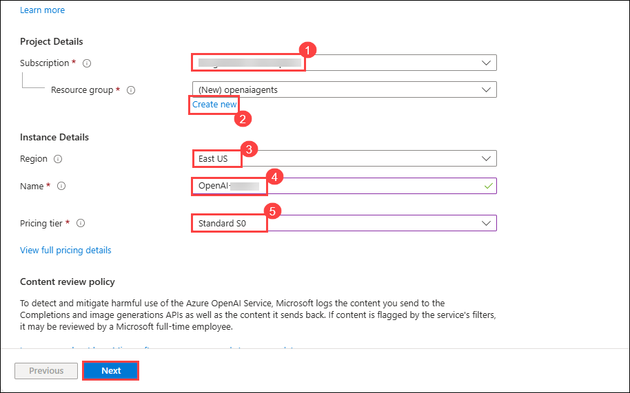
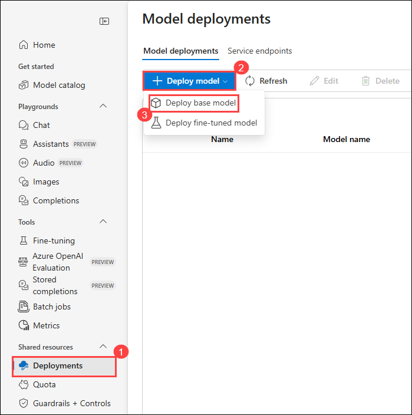
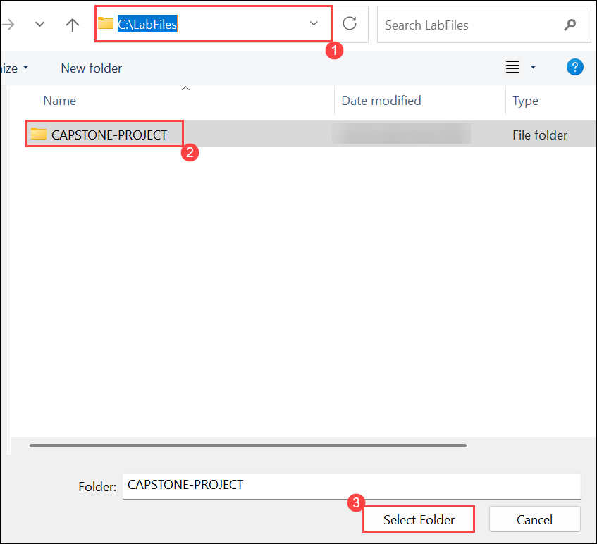
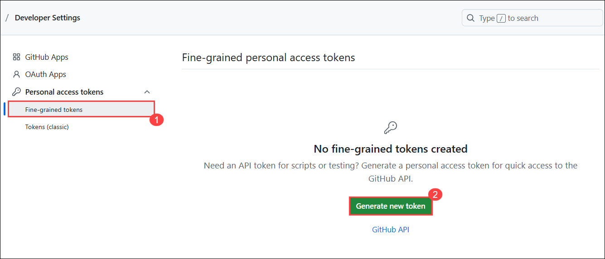
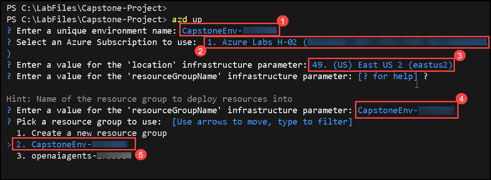

## 解决方案指南
# 多智能体系统 - 解决方案指南

## 简介

多智能体系统 （MAS） 由多个自主智能体组成，每个智能体都有不同的目标、行为和责任范围。这些代理独立运作，根据他们的当地知识和环境做出决策。但是，他们也可以相互交流和共享信息，根据他们的目标进行合作或竞争。MAS 通常用于任务分布在多个实体中并且系统受益于去中心化的场景。常见应用包括流量管理、机器人团队、分布式 AI 和网络系统，这些应用需要协调而不依赖中央控制器。

在这项挑战中，您将创建一个多代理系统，该系统接受用户的请求并通过一组代理进行处理，每个代理都根据特定的角色和专业领域进行设计。座席将单独分析请求，并根据他们定义的职责提供他们的响应。最终输出将是来自所有代理的答案的整合集合，以反映每个角色独特视角的方式协作解决用户的查询。

## 任务 1 - Azure AI Foundry 模型部署与环境配置

1. 访问 `https://portal.azure.com`，使用你的 Azure 凭据登录。

    - **电子邮件/用户名**：<inject key="AzureAdUserEmail"></inject>
    - **密码**：<inject key="AzureAdUserPassword"></inject>

1. 搜索并选择 Open AI。

   

1. 在 **Azure Open AI (1)** 内容页面，点击 **+ 创建 (2)**。

   

1. 提供以下详细信息，然后点击 **下一步**：

    - 订阅：保留默认订阅 **(1)**。

    - 资源组：点击 **创建新建 (2)**，命名为 **openaiagents**，然后点击确定。

    - 区域：**East US 2 (3)**

    - 名称：**OpenAI-<inject key="Deployment ID" enableCopy="false"/>** **(4)**

    - 定价层：**Standard SO (5)**

   

1. 连续点击两次 **下一步**，然后点击 **查看 + 提交**。

1. 检查所有值，然后点击 **创建**。

1. 部署完成后，点击 **转到资源**。

1. 在 Azure OpenAI 资源页面，点击 **转到 Azure AI Foundry 门户**，它会跳转到 Azure AI Foundry 门户。

   

1. 在左侧面板选择 **部署 (1)**。点击 **+ 部署模型 (2)**，然后选择 **部署基础模型 (3)**。

   

1. 搜索 **gpt-4o (1)**，**选择它 (2)**，然后点击 **确认 (3)**。

   

1. 点击 **自定义**，然后提供以下详细信息来部署 gpt-4o 模型：

    - 部署名称：**gpt4-o (1)**
    - 部署类型：**Global Standard (2)**
    - 模型版本：**2024-11-20 (3)**
    - 将 **每分钟令牌速率限制** 设置为 **200k (4)**。
    - 其他值保持默认，点击 **部署 (5)**。

   


1. 当 gpt-4o 部署完成后，复制 **目标 URI (1)** 和 **密钥 (2)**。**粘贴** 这些值到记事本中，备用。

   

1. 在你的实验室虚拟机上打开 VS Code。点击 **文件 (1)**，然后选择 **打开文件夹 (2)**。

   

1. 导航到路径 `C:\LabFiles\` **(1)**，选择 **CAPSTONE-PROJECT (2)**，然后点击 **选择文件夹 (3)**。

   

1. 选中 **复选框 (1)**，然后点击 **是的，我信任作者 (2)** 继续操作。

   

1. 展开 **src/ui** 文件夹，将文件名从 **Sample.env** 重命名为 **.env**。

   

1. 使用 Azure AI Foundry 部署详细信息更新 `.env` 文件并保存：

    ```
    AZURE_OPENAI_CHAT_DEPLOYMENT_NAME=替换为你的部署名称
    AZURE_OPENAI_ENDPOINT=替换为你的终端地址
    AZURE_OPENAI_API_KEY=替换为你的 API 密钥
    ```
   

## 任务 2 - 创建 GitHub 仓库并生成 PAT 令牌

1. 前往 [https://github.com](https://github.com) 并登录你的 GitHub 账户。

1. 创建一个新仓库，命名为 **Capstone-Project-<inject key="Deployment ID" enableCopy="false"/>** **(1)**。将仓库可见性设置为 **Public (2)**，然后点击 **Create Repository (3)**。

   

1. 仓库创建完成后，**复制你的仓库 URL** 并粘贴到记事本中备用。

   

1. 点击右上角的 **头像 (1)**，从下拉菜单中选择 **Settings (2)**。

   

1. 在左侧边栏中，点击 **<> Developer settings**。

   

1. 从左侧面板展开 **Personal access tokens**，选择 **Fine-grained tokens (1)**，然后点击 **Generate new token (2)**。

   

1. 在名称栏输入 **<inject key="Deployment ID" enableCopy="false"/>-PAT-RepoAccess** **（1）** 作为你的令牌名称。将过期时间设置为 **30 天（2）**。

   

1. 向下滚动，在 **仓库访问权限（Repository Access）** 部分，点击 **仅选择指定仓库（Only select repositories）（1）**。搜索 **Capstone-Project-<inject key="Deployment ID" enableCopy="false"/> 仓库（2）**，然后**勾选它（3）**。

     

1. 在 **权限（Permissions）** 部分，展开 **仓库权限（Repository Permissions）（1）**。在仓库权限下，将 **内容（Contents）（2）** 的访问权限设置为 **读取和写入（Read and Write）（3）**。

     

1. 滚动到页面底部，点击 **生成令牌（Generate token）（1）**，在弹窗中检查权限，然后点击 **生成令牌（Generate token）（2）**。

     

1. **复制（Copy）（1）** 生成的令牌，并**粘贴（Paste）**到记事本中备用。

   

## Task 3 - Define Agent Personas and Configure Multi-Agent Chat

1. 打开 `multi_agent.py` 文件。你将在这里实现本次挑战所需的所有代码。
   
1. 将 **multi_agent.py** 文件中的代码替换为以下链接中的代码，并保存该文件。

    ```
    https://docs-api.cloudlabs.ai/repos/raw.githubusercontent.com/CloudLabsAI-Azure/Capstone-Project/refs/heads/soln-guide/src/ui/multi_agent.py
    ```

    

1. 在 `src/ui` 目录下创建一个名为 `push_to_github.sh` 的文件。将以下链接中的代码粘贴进去，并保存该文件。

    ```
    https://docs-api.cloudlabs.ai/repos/raw.githubusercontent.com/CloudLabsAI-Azure/Capstone-Project/refs/heads/soln-guide/src/ui/push_to_github.sh
    ```

    

1. 在 `.env` 文件中，将以下环境变量更新为你在任务 2 中复制的值，并保存该文件。

    ```
    GITHUB_REPO_URL=替换为你的 Github 仓库地址
    GITHUB_PAT=替换为你的 Github PAT 令牌
    GIT_USER_EMAIL=替换为你的 Github 邮箱
    GITHUB_USERNAME=替换为你的 Github 用户名
    ```
    

1. 在 .env 文件中，点击底部状态栏的 **CRLF（1）**，然后选择 **LF（2）** 进行切换。完成后保存文件。

    

1. 确认在 `push_to_github.sh` 文件中也选择了 **LF**。

    

1. 点击 **省略号 (1)**，选择 **终端 (2)**，然后选择 **新建终端 (3)**。

    

1. 运行以下命令：

    ```
    azd auth login
    ```

    

1. 使用以下凭据登录：
    - **邮箱/用户名**: <inject key="AzureAdUserEmail"></inject>
    - **密码**: <inject key="AzureAdUserPassword"></inject>

1. 运行以下命令以在 Azure 上配置 Web 应用及所需资源：

    ```
    azd up
    ```

1. 运行 **azd up** 命令时，系统会交互式询问配置信息。请在提示时提供以下值：

   - **Unique Environment Name**: 输入 **CapstoneEnv-<inject key="Deployment ID" enableCopy="false"/>** **(1)**。
   - **Azure Subscription to use**: 选择出现的默认订阅 **(2)** 并按 **回车**。
   - **Location Infrastructure Parameter**: 从选项中选择 **East US 2** **(3)** 并按 **回车**。
   - **ResourceGroupName Infrastructure Parameter**: 输入 **CapstoneEnv-<inject key="Deployment ID" enableCopy="false"/>** **(4)** 并按 **回车**。
   - **Resource Group to use**: 从选项中选择 **CapstoneEnv-<inject key="Deployment ID" enableCopy="false"/>** **(5)** 并按 **回车**。

   

   - **注意：** 请等待约 5 分钟，直到命令完全执行完毕。

## 任务 4 - 多代理代码生成与仓库集成

1. 进入 Azure 门户，选择新创建的资源组，名称为 **rg-CapstoneEnv<inject key="Deployment ID" enableCopy="false"/>**。

1. 打开前缀为 **dev-ui-** 的容器应用。

    

1. 点击容器应用概览页面上的 **应用程序 URL**。

    

1. Streamlit 聊天应用将打开。尝试在聊天中输入以下提示 **(1)** 并点击 **发送**。

    ```
    创建一个简单计算器的代码
    ```
   - **注意：** 等待代理协作完成并给出回复。

    

1. 运行后，代理将提供代码和其他细节，输入 **approved (1)** 并点击 **发送 (2)** 以批准代码。聊天结束时，你可以看到代码在审批后被推送到仓库。

    

    

1. 进入仓库 **Capstone-Project-<inject key="Deployment ID" enableCopy="false"/>**，确认已创建 `generated_app.html` 文件，文件中包含你的简单计算器代码。

    

## 成功标准

- 你已实现多代理聊天系统，具备以下功能：
    - 生成请求应用的完整 HTML 和 JavaScript 源代码
    - 用户进行彻底的代码审核与批准流程
    - 应用自动部署到 Azure
    - 用户批准后，代码自动推送到 Git 仓库


## 额外奖励

- 将聊天记录中的代码复制到文件系统中的对应文件。
- 将 HTML 内容保存为 `index.html` 并在浏览器中打开。
- 测试应用是否按 AI 描述正常运行。
- 通过让 AI 使应用响应式或添加新功能来增强应用。
- 尝试修改角色设定以改进结果或功能。


## 学习资源

- [使用 Semantic Kernel 的代理组聊天](https://learn.microsoft.com/en-us/semantic-kernel/frameworks/agent/agent-chat?pivots=programming-language-python)
- [MetaGPT](https://github.com/geekan/MetaGPT)
- [AutoGen 多代理会话框架](https://microsoft.github.io/autogen/docs/Use-Cases/agent_chat/)
- [AutoGen 与 Semantic Kernel 集成](https://devblogs.microsoft.com/semantic-kernel/autogen-agents-meet-semantic-kernel/)

## 结论

本挑战演示了如何使用 Azure AI Foundry 和 Semantic Kernel 构建和协调多代理系统。通过为业务分析师、软件工程师和产品负责人设计不同角色，并配置带有终止策略的群聊环境，你创建了一个协作式 AI 工作流，能够收集需求、开发代码并执行代码审查。该任务结构允许使用自主、交互式代理以可扩展、分布式方式处理复杂问题。

# 你已成功完成实验！！
