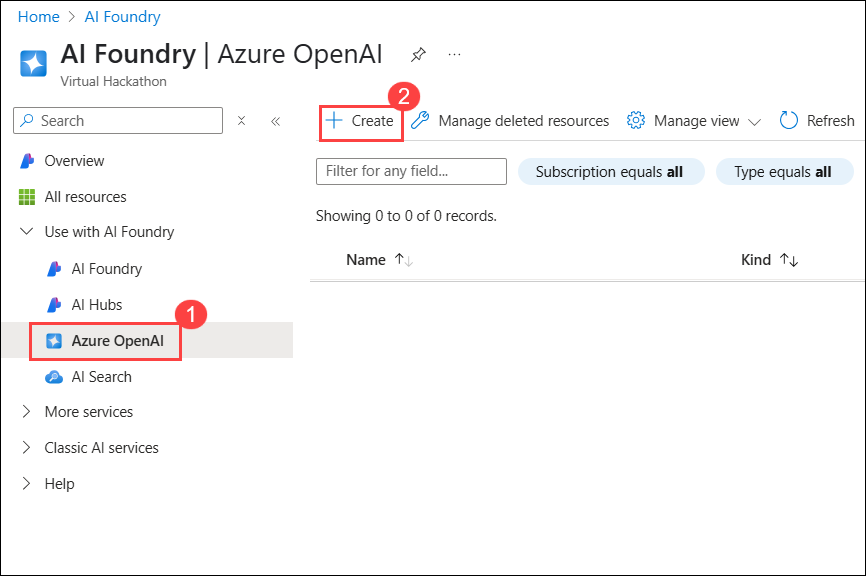
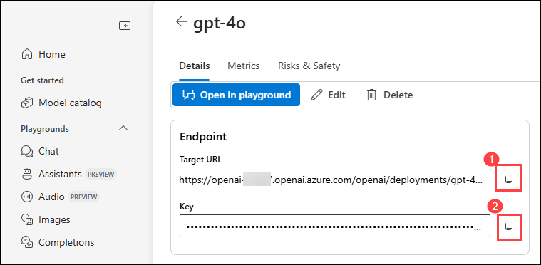
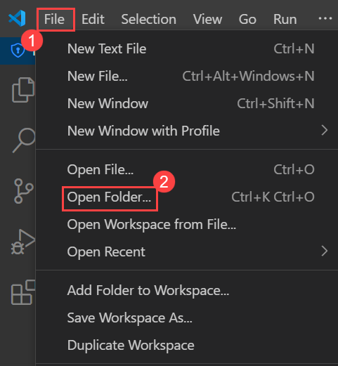
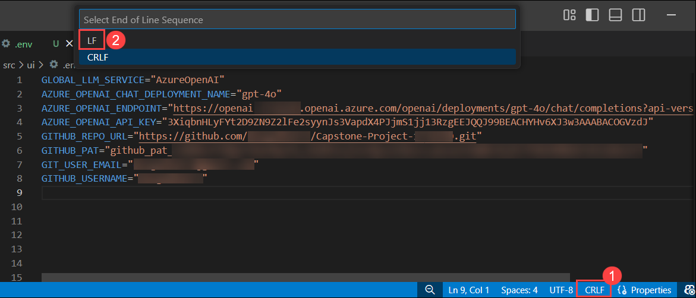
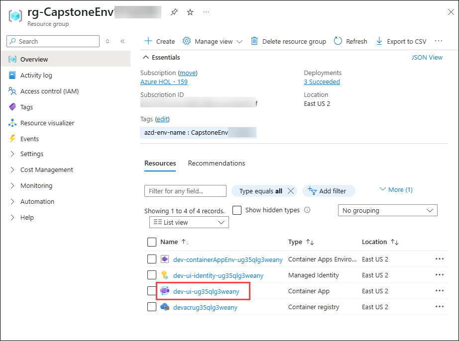
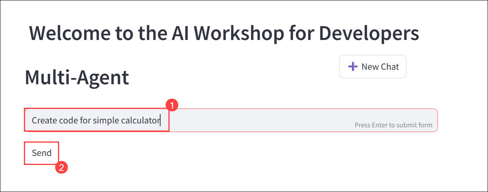

## 솔루션 가이드
# 다중 에이전트 시스템 - 솔루션 가이드

## 소개

MAS(Multi-Agent System)는 각각 고유한 목표, 동작 및 책임 영역을 가진 여러 자율 에이전트로 구성됩니다. 이러한 에이전트는 독립적으로 운영되며 현지 지식과 환경에 따라 결정을 내립니다. 그러나 그들은 또한 목표에 따라 협력하거나 경쟁하면서 서로 소통하고 정보를 공유할 수 있습니다. MAS는 일반적으로 작업이 여러 엔터티에 분산되어 있고 시스템이 분산화의 이점을 누리는 시나리오에서 사용됩니다. 일반적인 애플리케이션에는 교통 관리, 로봇 팀, 분산된 AI 및 중앙 컨트롤러에 의존하지 않고 조정이 필요한 네트워크 시스템이 포함됩니다.

이 챌린지에서는 사용자의 요청을 수락하고 각각 특정 페르소나와 전문 분야로 설계된 에이전트 컬렉션을 통해 처리하는 다중 에이전트 시스템을 만듭니다. 상담원은 개별적으로 요청을 분석하고 정의된 책임에 따라 응답을 제공합니다. 최종 출력은 모든 상담원의 답변을 통합한 모음으로, 각 페르소나의 고유한 관점을 반영하는 방식으로 사용자의 쿼리를 공동으로 해결합니다.

## 작업 1 - Azure AI Foundry 모델 배포 및 환경 구성

1. `https://portal.azure.com`에 접속하여 Azure 자격 증명으로 로그인합니다.

    - **Email/Username**: <inject key="AzureAdUserEmail"></inject>
    - **Password**: <inject key="AzureAdUserPassword"></inject>

1. 검색창에 Open AI를 입력하고 선택합니다. 

   

1. **Azure Open AI (1)** 콘텐츠 페이지에서 **+ 만들기(create)(2)** 버튼을 클릭합니다.

   

1. 다음 정보를 입력하고 **다음(Next)**을 클릭합니다:

    - 구독(Subscription): 기본 구독 **(1)**을 유지합니다.

    - 리소스 그룹(Resource Group): **새로 만들기(Create new)(2)**를 클릭하고 이름을 **openaiagents**로 지정한 후 확인(OK)을 클릭합니다.

    - 지역(Region): **East US 2 (3)**

    - 이름(Name): **OpenAI-<inject key="Deployment ID" enableCopy="false"/>** **(4)**

    - 가격 책정 티어(Pricing Tier): **Standard SO (5)**

   

1. 두 번 **다음(Next)**을 클릭한 후 **검토 + 제출(Review + Submit)**을 클릭합니다.

1. 모든 값을 검토하고 **만들기(Create)**를 클릭합니다.

1. 배포가 완료되면 **리소스로 이동(Go to resource)**을 클릭합니다.

1. Azure OpenAI 리소스 창에서 **Azure AI Foundry 포털로 이동(Go to Azure AI Foundry portal)**을 클릭하면 Azure AI Foundry 포털로 이동합니다.

   

1. 왼쪽 패널에서 **배포(Deployments)(1)**를 선택합니다. **+ 모델 배포(Deploy Model)(2)**를 클릭하고 **기본 모델 배포(Deploy Base Model)(3)**를 선택합니다.

   

1. **gpt-4o (1)**를 검색하고, **선택(select it)(2)**한 후 **확인(Confirm)(3)**을 클릭합니다.

   

1. **사용자 지정(Customize)**을 클릭하고 gpt-4o 모델을 배포하기 위해 다음 정보를 입력합니다:

    - 배포 이름(Deployment name): **gpt4-o (1)**
    - 배포 유형(Deployment type): **Global Standard (2)**
    - 모델 버전(Model Version): **2024-11-20 (3)**
    - **토큰당 분당 제한(Tokens per Minute Rate Limit)**을 **200k (4)**로 설정합니다.
    - 나머지 값은 기본값으로 두고 **배포(Deploy)(5)**를 클릭합니다.

   

1. gpt-4o 배포가 완료되면, **대상 URI(Target URI)(1)**와 **키(Key)(2)**를 복사하여 메모장에 붙여넣기하여 저장합니다.

   

1. Lab VM에서 VS Code를 열고, **파일(File)(1)**을 클릭한 후 **폴더 열기(Open Folder)(2)**를 선택합니다.

   

1. `C:\LabFiles\` 경로 **(1)**로 이동하여 **CAPSTONE-PROJECT (2)** 폴더를 선택한 후 **폴더 선택(Select Folder)(3)**을 클릭합니다.

   

1. **체크박스(checkbox)(1)**를 선택하고 **예, 저자를 신뢰합니다(Yes, I trust the authors)(2)**를 클릭하여 진행합니다.

   

1. **src/ui** 폴더를 확장하고, **Sample.env** 파일 이름을 **.env**로 변경합니다.

   

1. `.env` 파일을 열어 Azure AI Foundry 배포 정보를 업데이트하고 저장합니다:

    ```
    AZURE_OPENAI_CHAT_DEPLOYMENT_NAME=배포 이름으로 교체하세요
    AZURE_OPENAI_ENDPOINT=엔드포인트 URL로 교체하세요
    AZURE_OPENAI_API_KEY=API 키로 교체하세요
    ```

   

## 작업 2 - GitHub 저장소 생성 및 PAT 토큰 생성

1. [https://github.com](https://github.com)에서 GitHub에 로그인합니다.

1. **Capstone-Project-<inject key="Deployment ID" enableCopy="false"/>** **(1)**라는 이름으로 새 저장소를 생성합니다. 저장소 가시성을 **공개(Public)(2)**로 설정한 후 **저장소 생성(Create Repository)(3)**을 클릭합니다.

   

1. 새 저장소가 생성되면, 저장소 **URL을 복사**하여 메모장에 붙여넣기해 둡니다.

   

1. 오른쪽 상단의 **프로필 사진(profile picture)(1)**을 클릭하고 드롭다운 메뉴에서 **설정(Settings)(2)**을 선택합니다.

   

1. 왼쪽 사이드바에서 **<> 개발자 설정(Developer settings)**을 클릭합니다.

   

1. 왼쪽 패널에서 **개인 액세스 토큰(Personal access tokens)**을 확장합니다. **세분화된 토큰(Fine-grained tokens)(1)**을 선택하고 **새 토큰 생성(Generate new token)(2)**을 클릭합니다.

   
 
1. 토큰 이름으로 **<inject key="Deployment ID" enableCopy="false"/>-PAT-RepoAccess** **(1)**를 입력합니다. 만료 날짜는 **30일(30 days)(2)**로 설정합니다.

   

1. 아래로 스크롤하여 **저장소 액세스(Repository Access)** 항목에서 **선택한 저장소만(Only select repositories)(1)**을 클릭합니다. **Capstone-Project-<inject key="Deployment ID" enableCopy="false"/> 저장소(repository)** **(2)**를 검색하고 **선택(select it)(3)**합니다.

   

1. **권한(Permissions)** 섹션에서 **저장소 권한(Repository Permissions)(1)**을 확장합니다. 저장소 권한 아래 **컨텐츠(Contents)(2)**에 대해 **읽기 및 쓰기(Read and Write)(3)** 권한을 부여합니다.

   

1. 페이지 하단으로 스크롤하여 **토큰 생성(Generate token)(1)**을 클릭하고, 팝업에서 권한을 검토한 후 다시 **토큰 생성(Generate token)(2)**을 클릭합니다.

   

1. 생성된 토큰을 **복사(Copy)(1)**하여 메모장에 붙여넣기해 둡니다.

   

   
## 작업 3 - 에이전트 페르소나 정의 및 다중 에이전트 채팅 구성

1. `multi_agent.py` 파일을 엽니다. 이곳에 이번 챌린지를 위한 모든 필요한 코드를 구현합니다.

1. **multi_agent.py** 파일의 코드를 아래 링크의 코드로 교체한 후 저장합니다.

    ```
    https://docs-api.cloudlabs.ai/repos/raw.githubusercontent.com/CloudLabsAI-Azure/Capstone-Project/refs/heads/soln-guide/src/ui/multi_agent.py
    ```

    

1. `src/ui` 디렉토리 아래에 `push_to_github.sh`라는 파일을 생성합니다. 아래 링크의 코드를 붙여넣고 저장합니다.

    ```
    https://docs-api.cloudlabs.ai/repos/raw.githubusercontent.com/CloudLabsAI-Azure/Capstone-Project/refs/heads/soln-guide/src/ui/push_to_github.sh
    ```

    

1. `.env` 파일에서 아래 환경 변수들을 작업 2에서 복사한 값들로 업데이트하고 저장합니다.

    ```
    GITHUB_REPO_URL=Github 저장소 URL로 교체하세요
    GITHUB_PAT=Github PAT 토큰으로 교체하세요
    GIT_USER_EMAIL=Github 이메일로 교체하세요
    GITHUB_USERNAME=Github 사용자 이름으로 교체하세요
    ```

    

1. `.env` 파일에서 하단 상태 표시줄의 **CRLF (1)**를 클릭하고, **LF (2)**로 변경합니다. 변경 후 파일을 저장합니다.

   

1. `push_to_github.sh` 파일에서도 **LF**가 선택되어 있는지 확인합니다.

   

1. **점 3개(ellipsis)(1)**를 클릭하고 **터미널(Terminal)(2)**을 선택한 후 **새 터미널(New Terminal)(3)**을 선택합니다.

   

1. 다음 명령어를 실행합니다:

    ```
    azd auth login
    ```

   

1. 다음 자격 증명으로 로그인합니다:
    - **Email/Username**: <inject key="AzureAdUserEmail"></inject>
    - **Password**: <inject key="AzureAdUserPassword"></inject>

1. 웹 앱 및 필요한 리소스를 Azure에 프로비저닝하기 위해 다음 명령어를 실행합니다:

    ```
    azd up
    ```

1. **azd up** 명령어 실행 시 구성 정보를 대화식으로 입력하라는 요청이 나타납니다. 다음 값을 입력하세요:

   - **고유 환경 이름(Unique Environment Name)**: **CapstoneEnv-<inject key="Deployment ID" enableCopy="false"/>** **(1)** 입력
   - **사용할 Azure 구독(Azure Subscription to use)**: 기본 구독 **(2)** 선택 후 **Enter** 누름
   - **Location 인프라 매개변수(Location Infrastructure Parameter)**: 옵션 중에서 **East US 2** **(3)** 선택 후 **Enter** 누름
   - **ResourceGroupName 인프라 매개변수(ResourceGroupName Infrastructure Parameter)**: **CapstoneEnv-<inject key="Deployment ID" enableCopy="false"/>** **(4)** 입력 후 **Enter** 누름
   - **사용할 리소스 그룹(Resource Group to use)**: 옵션 중에서 **CapstoneEnv-<inject key="Deployment ID" enableCopy="false"/>** **(5)** 선택 후 **Enter** 누름

   

   - **참고:** 명령어가 완전히 실행될 때까지 약 5분 정도 기다리세요.

## 작업 4 - 다중 에이전트 코드 생성 및 리포지토리 통합

1. Azure 포털로 이동하여 새로 생성된 리소스 그룹 **rg-CapstoneEnv<inject key="Deployment ID" enableCopy="false"/>**를 선택합니다.

1. 접두사가 **dev-ui-**인 컨테이너 앱을 엽니다.

    

1. 컨테이너 앱 개요 페이지에 있는 **애플리케이션 URL(Application URL)**을 클릭합니다.

    

1. Streamlit 채팅 애플리케이션이 열립니다. 채팅에 **아래 프롬프트 (1)**를 입력하고 **전송(send)** 버튼을 클릭하세요.

    ```
    Create code for simple calculator
    ```
   - **참고:** 에이전트들이 협업하여 응답할 때까지 기다리세요.

    

1. 코드와 기타 세부 정보가 제공되면, **approved (1)**를 입력하고 **전송(send) (2)**을 선택하여 코드를 승인하세요. 채팅이 끝날 때 코드가 승인 후 리포지토리에 푸시되는 것을 확인할 수 있습니다.

    

    

1. 리포지토리 **Capstone-Project-<inject key="Deployment ID" enableCopy="false"/>**로 이동하여 `generated_app.html` 파일이 생성되었는지 확인합니다. 이 파일에는 간단한 계산기 코드가 포함되어 있습니다.

    

## 성공 기준

- 요청한 애플리케이션에 대해 다음을 구현한 멀티 에이전트 채팅 시스템을 완성했습니다:
    - HTML 및 JavaScript로 완성된 소스 코드 생성
    - 사용자에 의한 철저한 코드 리뷰 및 승인 프로세스
    - Azure로의 자동화된 애플리케이션 배포
    - 사용자 승인 후 Git 리포지토리로의 자동 코드 푸시


## 보너스

- 채팅 기록 마크다운에서 코드를 복사하여 파일 시스템의 대응 파일에 붙여넣기 합니다.
- HTML 내용을 `index.html`로 저장하고 웹 브라우저에서 실행합니다.
- AI가 설명한 대로 애플리케이션이 작동하는지 테스트합니다.
- AI에게 반응형 디자인을 적용하거나 새로운 기능을 추가하도록 요청하여 앱을 개선합니다.
- 페르소나를 수정하여 결과나 기능을 향상시키는 실험을 해봅니다.


## 학습 자료

- [Agent Group Chat with Semantic Kernel](https://learn.microsoft.com/en-us/semantic-kernel/frameworks/agent/agent-chat?pivots=programming-language-python)
- [MetaGPT](https://github.com/geekan/MetaGPT)
- [AutoGen Multi-Agent Conversational Framework](https://microsoft.github.io/autogen/docs/Use-Cases/agent_chat/)
- [AutoGen with Semantic Kernel](https://devblogs.microsoft.com/semantic-kernel/autogen-agents-meet-semantic-kernel/)

## 결론

이 챌린지는 Azure AI Foundry와 Semantic Kernel을 사용하여 멀티 에이전트 시스템을 구축하고 조율하는 방법을 보여주었습니다. 비즈니스 애널리스트, 소프트웨어 엔지니어, 제품 책임자의 개별 페르소나를 설계하고 종료 전략이 포함된 그룹 채팅 환경을 구성함으로써, 요구사항 수집, 코드 개발, 코드 리뷰를 수행하는 협업 AI 워크플로우를 만들었습니다. 이 작업 구조는 자율적이고 상호작용하는 에이전트를 통해 복잡한 문제를 분산 처리하며 확장할 수 있도록 설계되었습니다.

# 실습을 성공적으로 완료하셨습니다 !!
