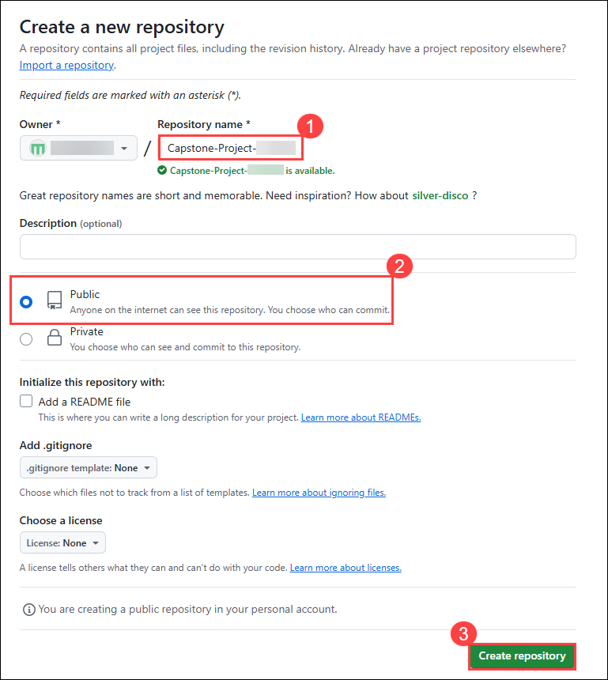
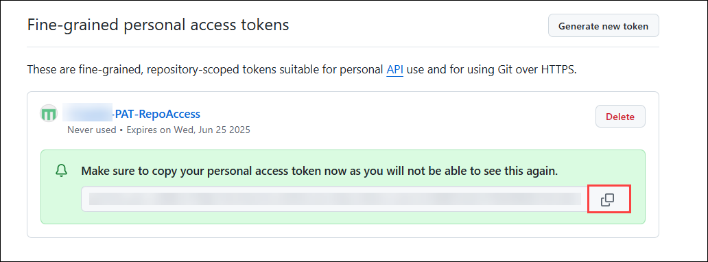

## 解決方案指南
# 多代理系統 - 解決方案指南

## 介紹

多代理系統（Multi-Agent Systems，簡稱 MAS）由多個自主代理組成，每個代理都有不同的目標、行為和責任範圍。這些代理能獨立運作，根據自身的本地知識與環境做出決策。然而，它們也能彼此溝通與分享資訊，根據各自的目標進行合作或競爭。MAS 通常用於任務分散在多個實體，且系統透過去中心化運作能獲得效益的場景。常見應用包含交通管理、機器人團隊、分散式 AI 以及需要協調但不依賴中央控制器的網路系統。

在此挑戰中，你將建立一個多代理系統，該系統接收使用者的請求並透過一組各具特定角色與專長領域的代理來處理。各代理會獨立分析請求，並根據其責任範圍提供回應。最終輸出將是所有代理回應的綜合集合，協同回答使用者的問題，並反映每個角色獨特的觀點。

## 任務 1 - Azure AI Foundry 模型部署與環境配置

1. 前往 `https://portal.azure.com` 並使用您的 Azure 帳戶登入。

    - **電子郵件/使用者名稱**：<inject key="AzureAdUserEmail"></inject>
    - **密碼**：<inject key="AzureAdUserPassword"></inject>

1. 搜尋並選擇 Open AI。

   

1. 在 **Azure Open AI (1)** 頁面，點擊 **+ 建立(2)**。

   

1. 提供以下資訊並點擊 **下一步**：

    - 訂閱：保持預設訂閱 **(1)**。

    - 資源群組：點擊 **建立新資源群組 (2)**，名稱填寫 **openaiagents**，然後點擊確定。

    - 區域：**East US 2 (3)**

    - 名稱：**OpenAI-<inject key="Deployment ID" enableCopy="false"/>** **(4)**

    - 價格層級：**Standard SO (5)**

   

1. 連續點擊兩次下一步，然後點擊 **審查 + 提交**。

1. 檢查所有設定值，然後點擊 **建立**。

1. 部署完成後，點擊 **前往資源**。

1. 在 Azure OpenAI 資源面板中，點擊 **前往 Azure AI Foundry 入口網站**，系統會導向 Azure AI Foundry 入口網站。

   

1. 在左側面板選擇 **部署 (1)**。點擊 **+ 部署模型 (2)**，選擇 **部署基礎模型 (3)**。

   

1. 搜尋 **gpt-4o (1)**，**選取它 (2)**，然後點擊 **確認 (3)**。

   

1. 點擊 **自訂** 並提供以下資訊來部署 gpt-4o 模型：

    - 部署名稱：**gpt4-o (1)**
    - 部署類型：**全球標準 (2)**
    - 模型版本：**2024-11-20 (3)**
    - 將 **每分鐘標記數限制** 設為 **200k (4)**。
    - 其餘選項維持預設，點擊 **部署 (5)**。

   

1. 當 gpt-4o 部署完成後，複製 **目標 URI (1)** 及 **金鑰 (2)**。將這些值 **貼上** 到記事本以便後續使用。

   

1. 在您的實驗室虛擬機器上開啟 VS Code。點擊 **檔案 (1)**，選擇 **開啟資料夾 (2)**。

   

1. 導覽至路徑 `C:\LabFiles\` **(1)**，選擇 **CAPSTONE-PROJECT (2)**，然後點擊 **選擇資料夾 (3)**。

   

1. 勾選 **核取方塊 (1)**，點擊 **是，我信任作者 (2)** 以繼續。

   

1. 展開 **src/ui** 資料夾，將檔案由 **Sample.env** 重新命名為 **.env**。

   

1. 使用 Azure AI Foundry 部署細節更新 `.env` 檔案並儲存：

    ```
    AZURE_OPENAI_CHAT_DEPLOYMENT_NAME=請替換為您的部署名稱
    AZURE_OPENAI_ENDPOINT=請替換為您的端點 URL
    AZURE_OPENAI_API_KEY=請替換為您的 API 金鑰
    ```
   


## 任務 2 - 建立 GitHub 儲存庫並產生 PAT 令牌

1. 登入 GitHub，網址為 [https://github.com](https://github.com)。

1. 建立一個新的儲存庫，名稱為 **Capstone-Project-<inject key="Deployment ID" enableCopy="false"/>** **(1)**。將儲存庫能見度設定為 **公開 (2)**，然後點擊 **建立儲存庫 (3)**。

   

1. 新儲存庫建立完成後，**複製您的儲存庫 URL**，並貼到記事本中以備後用。

   

1. 點擊右上角的 **個人頭像 (1)**，從下拉選單選擇 **設定 (2)**。

   

1. 在左側邊欄，點擊 **<> 開發者設定**。

   

1. 在左側面板展開 **個人存取令牌**，選擇 **細粒度令牌 (1)**，然後點擊 **產生新令牌 (2)**。

   

1. 輸入名稱為 **<inject key="Deployment ID" enableCopy="false"/>-PAT-RepoAccess** **(1)** 的令牌名稱，並將過期日期設定為 **30 天 (2)**。

   

1. 向下捲動，在 **儲存庫存取權限** 區塊中，點選 **僅選擇儲存庫 (1)**。搜尋 **Capstone-Project-<inject key="Deployment ID" enableCopy="false"/> 儲存庫** **(2)**，並 **選擇它 (3)**。

     

1. 在 **權限** 區塊中，展開 **儲存庫權限 (1)**。在儲存庫權限下，為 **內容 (2)** 提供 **讀取與寫入 (3)** 權限。

     

1. 向頁面底部捲動，點擊 **產生令牌 (1)**，在跳出視窗中確認權限後，點擊 **產生令牌 (2)**。

     

1. **複製 (1)** 產生的令牌，並 **貼上** 到記事本中以備後續使用。

     

   
## 任務 3 - 定義代理人角色並配置多代理聊天

1. 打開 `multi_agent.py` 檔案。這是您將實作本挑戰所有必要程式碼的地方。

1. 將 **multi_agent.py** 檔案中的程式碼替換為以下連結中的程式碼，並儲存檔案。

    ```
    https://docs-api.cloudlabs.ai/repos/raw.githubusercontent.com/CloudLabsAI-Azure/Capstone-Project/refs/heads/soln-guide/src/ui/multi_agent.py
    ```

    

1. 在 `src/ui` 目錄下建立一個名為 `push_to_github.sh` 的檔案。將以下連結中的程式碼貼上並儲存該檔案。

    ```
    https://docs-api.cloudlabs.ai/repos/raw.githubusercontent.com/CloudLabsAI-Azure/Capstone-Project/refs/heads/soln-guide/src/ui/push_to_github.sh
    ```

    

1. 更新 `.env` 檔案中的以下環境變數，使用您在任務 2 複製的值，並儲存檔案。

    ```
    GITHUB_REPO_URL=請替換成您的 Github 儲存庫 URL
    GITHUB_PAT=請替換成您的 Github 個人訪問令牌
    GIT_USER_EMAIL=請替換成您的 Github 電子郵件
    GITHUB_USERNAME=請替換成您的 Github 使用者名稱
    ```

    

1. 在 `.env` 檔案中，點擊底部狀態列的 **CRLF (1)**，並選擇改成 **LF (2)**。修改後請儲存檔案。

    

1. 確認 `push_to_github.sh` 檔案中的行結尾格式也選擇為 **LF**。

    

1. 點擊 **省略號 (1)**，選擇 **Terminal (2)**，然後點選 **New Terminal (3)**。

    

1. 執行以下指令：

    ```
    azd auth login
    ```

    

1. 使用以下憑證登入：
    - **Email/Username**: <inject key="AzureAdUserEmail"></inject>
    - **Password**: <inject key="AzureAdUserPassword"></inject>

1. 執行以下指令，將 Web 應用程式與所需資源部署至 Azure：

    ```
    azd up
    ```

1. 當執行 **azd up** 指令時，系統將互動式要求您提供設定值，請依提示輸入以下資料：

   - **Unique Environment Name**：輸入 **CapstoneEnv-<inject key="Deployment ID" enableCopy="false"/>** **(1)**。
   - **Azure Subscription to use**：選擇預設顯示的訂閱 **(2)**，然後按 **Enter**。
   - **Location Infrastructure Parameter**：選擇 **East US 2** **(3)**，再按 **Enter**。
   - **ResourceGroupName Infrastructure Parameter**：輸入 **CapstoneEnv-<inject key="Deployment ID" enableCopy="false"/>** **(4)**，然後按 **Enter**。
   - **Resource Group to use**：從選項中選擇 **CapstoneEnv-<inject key="Deployment ID" enableCopy="false"/>** **(5)**，再按 **Enter**。

   

   - **注意**：請等待約 5 分鐘，直到指令完整執行完成。

## Task 4 - 多代理程式碼產生與儲存庫整合

1. 前往 Azure Portal，並選取新建立的 Resource group，名稱為 **rg-CapstoneEnv<inject key="Deployment ID" enableCopy="false"/>**。

1. 開啟名稱以 **dev-ui-** 為前綴的 Container App。

    

1. 在 Container App 的 Overview 頁面上，點選 **Application URL**。

    

1. Streamlit 聊天應用程式將會開啟。在對話框中輸入以下提示 **(1)**，然後點選 **send**。

    ```
    Create code for simple calculator
    ```
   - **注意**：請等待代理 (agents) 之間協作並提供回覆。

    

1. 當它完成執行並提供程式碼與其他細節後，輸入 **approved (1)**，並點選 **send (2)**，以核准該程式碼。在對話結束時，你將能看到該程式碼被推送到儲存庫。

    

    

1. 前往儲存庫 **Capstone-Project-<inject key="Deployment ID" enableCopy="false"/>**，確認 `generated_app.html` 檔案已經建立，並且內含你的簡易計算機程式碼。

    

## 成功標準

- 你已經成功實作了 Multi-Agent Chat 系統，能夠達成以下功能：
    - 根據使用者需求，產生完整的 HTML 和 JavaScript 原始碼
    - 透過使用者進行完整的程式碼審查與核准流程
    - 自動將應用程式部署至 Azure
    - 在使用者核准後，自動將程式碼推送至 Git 儲存庫

## 加分項目

- 將聊天記錄中的 Markdown 程式碼複製到本地檔案系統的對應檔案內。
- 將 HTML 內容儲存為 `index.html`，並在瀏覽器中開啟。
- 測試應用程式是否如 AI 所描述般正常運作。
- 向 AI 要求將應用程式調整為響應式 (Responsive) 或新增新功能，強化程式。
- 嘗試修改不同角色 (Personas) 的設定，以優化結果或功能表現。

## 學習資源

- [使用 Semantic Kernel 實作 Agent Group Chat](https://learn.microsoft.com/zh-tw/semantic-kernel/frameworks/agent/agent-chat?pivots=programming-language-python)
- [MetaGPT](https://github.com/geekan/MetaGPT)
- [AutoGen 多代理對話框架](https://microsoft.github.io/autogen/docs/Use-Cases/agent_chat/)
- [AutoGen 與 Semantic Kernel 整合](https://devblogs.microsoft.com/semantic-kernel/autogen-agents-meet-semantic-kernel/)

## 結論

本挑戰展示了如何利用 Azure AI Foundry 和 Semantic Kernel 建立並協調 Multi-Agent System。透過為 Business Analyst、Software Engineer 和 Product Owner 設計專屬角色，並配置群組對話環境與終止策略，你成功建構出一個可協同合作的 AI 工作流程，能夠收集需求、產生程式碼並進行程式碼審查。這樣的任務架構能支援具延展性、分散式的方式，藉由自主且互動式的代理，處理複雜問題。

# 你已成功完成本次 Lab！
