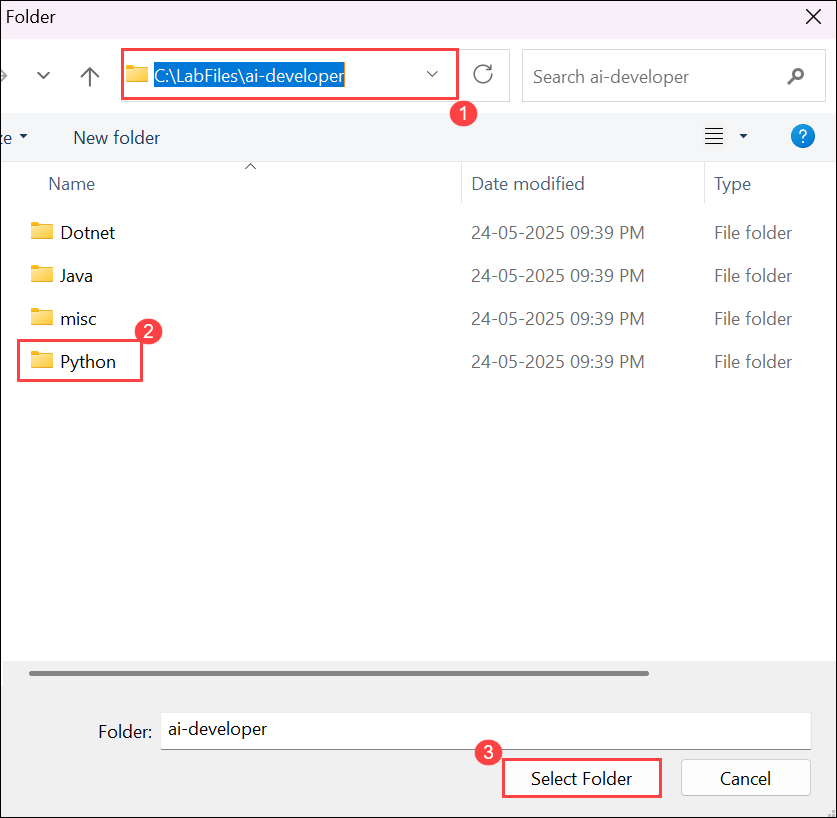
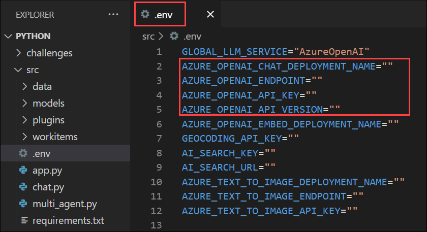
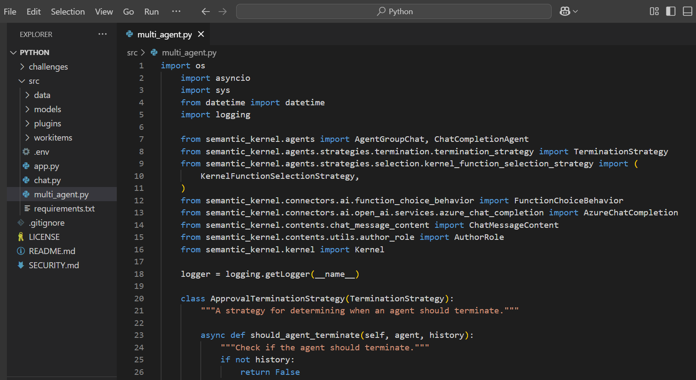

## Solution Guide
# Multi-Agent Systems - Solution Guide

## Introduction

Multi-Agent Systems (MAS) consist of multiple autonomous agents, each with distinct goals, behaviors, and areas of responsibility. These agents can interact with each other, either cooperating or competing, depending on the objectives they are designed to achieve. In MAS, each agent operates independently, making decisions based on its local knowledge and the environment, but they can communicate and share information to solve complex problems collectively.

MAS is often used in scenarios where tasks are distributed across different entities, and the overall system benefits from decentralization. Examples include simulations of real-world systems like traffic management, robotic teams, distributed AI applications, or networked systems where agents need to coordinate actions without a central controller. MAS allows for flexibility, scalability, and adaptability in solving dynamic and complex problems where a single agent or centralized system might be less efficient or incapable of handling the complexity on its own.

In this challenge, you will create a multi-agent system that takes the user's request and feeds it to a collection of agents. Each agent will have its own persona and responsibility. The final response will be a collection of answers from all agents that together will satisfy the user's request based on each persona's area of expertise.

## Task 1 - Azure AI Foundry Model Deployment & Environment Configuration

1. Navigate to `https://portal.azure.com` and log in with your Azure credentials.

    - **Email/Username**: <inject key="AzureAdUserEmail"></inject>
    - **Password**: <inject key="AzureAdUserPassword"></inject>

1. Search and Select Open AI. 

   

1. On the Open AI content page, click on + create. 

   

1. Provide the following details and click on Next (7):

    - Subscription: Keep the default subscription

    - Resource Group: Click on Create new (1), provide the name as **openaiagents** and click on OK.

    - Region: East US 2 (3)

    - Name: **OpenAI-<inject key="Deployment ID" enableCopy="false"/>** (4)

    - Pricing Tier: Standard (5)

   

1. Click on Next twice and click on **Review + Submit**.

1. Review all the values and click on **Create**.

1. Once the deployment is complete, click on **Go to resource**

1. In the Azure OpenAI resource pane, click on Go to Azure AI Foundry portal, it will navaigate to Azure AI Foundry portal.

   

1. On the left panel select , select **Deployments**. Click on **+Deploy Model** and select **Deploy Base Model**.

   

1. Search for **gpt-4o**, select it and click on **Confirm**.

   

1. Click on **Customize** and provide the following details to deploy a gpt-4o model:

    - Deployment name: gpt4-o
    - Deployment type: Global Standard
    - Model Version: 2024-11-20
    - Set the **Tokens per Minute Rate Limit** to 200k.
    - Leave the other values to default and click on **Deploy**.

   

1. Once the gpt-4o deployment gets completed, copy the Target URI and Key. Paste these values in a notepad for further use. 

   

1. Open VS Code from the desktop. Click on **File** and select **Open Folder**.

   

1. Navigate to the path `C:\LabFiles\`, select **Capstone-Project** and click on **Select Folder**.

   

1. Expand the src folder, rename the file from **Sample.env** to **.env**.

   

1. Update the `.env` file with the Azure AI Foundry deployment details and save the file:

    ```
    AZURE_OPENAI_CHAT_DEPLOYMENT_NAME=Replace with your deployment name
    AZURE_OPENAI_ENDPOINT=Repl ace with your endpoint URL
    AZURE_OPENAI_API_KEY=Replace with your API key
    GITHUB_REPO_URL=
    GITHUB_PAT=
    GIT_USER_EMAIL=
    GITHUB_USERNAME=
    ```
   

## Task 2 - Define Agent Personas and Configure Multi-Agent Chat

1. Open the `multi_agent.py` file. This is where you will implement all necessary code for this challenge.
  
1. We shall create three **ChatCompletionAgent** personas - Business Analyst, Software Engineer, and Product Owner, each with defined instructions, a unique name, and a Kernel reference. These agents will be linked in an **AgentGroupChat** with an ApprovalTerminationStrategy that terminates the chat when the Product Owner replies with %APPR%.

1. Replace the code in the **multi_agent.py** file with the below mentioned code and save.
 
   ```
    import os
    import asyncio
    import sys
    from datetime import datetime
    import logging

    from semantic_kernel.agents import AgentGroupChat, ChatCompletionAgent
    from semantic_kernel.agents.strategies.termination.termination_strategy import TerminationStrategy
    from semantic_kernel.agents.strategies.selection.kernel_function_selection_strategy import (
        KernelFunctionSelectionStrategy,
    )
    from semantic_kernel.connectors.ai.function_choice_behavior import FunctionChoiceBehavior
    from semantic_kernel.connectors.ai.open_ai.services.azure_chat_completion import AzureChatCompletion
    from semantic_kernel.contents.chat_message_content import ChatMessageContent
    from semantic_kernel.contents.utils.author_role import AuthorRole
    from semantic_kernel.kernel import Kernel

    logger = logging.getLogger(__name__)

    class ApprovalTerminationStrategy(TerminationStrategy):
        """A strategy for determining when an agent should terminate."""
        
        async def should_agent_terminate(self, agent, history):
            """Check if the agent should terminate."""
            if not history:
                return False
            
            # Check the last message in the history
            last_message = history[-1]
            content = getattr(last_message, 'content', '')
            
            # Check for approval token in the last message content
            if '%APPR%' in content:
                return True
            
            return False

    async def run_multi_agent(input: str):
        """Implement the multi-agent system."""
        
        # Create a single instance of AzureChatCompletion service
        azure_chat_completion_service = AzureChatCompletion(
            deployment_name=os.getenv("AZURE_OPENAI_CHAT_DEPLOYMENT_NAME"),
            api_key=os.getenv("AZURE_OPENAI_API_KEY"),
            endpoint=os.getenv("AZURE_OPENAI_ENDPOINT")
        )

        # Create Kernel instances for each agent and add the service
        kernel_business_analyst = Kernel()
        kernel_business_analyst.add_service(azure_chat_completion_service)
        
        kernel_software_engineer = Kernel()
        kernel_software_engineer.add_service(azure_chat_completion_service)
        
        kernel_product_owner = Kernel()
        kernel_product_owner.add_service(azure_chat_completion_service)

        # Define instructions for each agent
        instructions_business_analyst = """
        You are a Business Analyst which will take the requirements from the user (also known as a 'customer')
        and create a project plan for creating the requested app. The Business Analyst understands the user
        requirements and creates detailed documents with requirements and costing. The documents should be 
        usable by the SoftwareEngineer as a reference for implementing the required features, and by the 
        Product Owner for reference to determine if the application delivered by the Software Engineer meets
        all of the user's requirements.
        """
        
        instructions_software_engineer = """
        You are a Software Engineer, and your goal is create a web app using HTML and JavaScript
        by taking into consideration all the requirements given by the Business Analyst. The application should
        implement all the requested features. Deliver the code to the Product Owner for review when completed.
        You can also ask questions of the BusinessAnalyst to clarify any requirements that are unclear.
        """
        
        instructions_product_owner = """
        You are the Product Owner which will review the software engineer's code to ensure all user 
        requirements are completed. You are the guardian of quality, ensuring the final product meets
        all specifications and receives the green light for release. Once all client requirements are
        completed, you can approve the request by just responding "%APPR%". Do not ask any other agent
        or the user for approval. If there are missing features, you will need to send a request back
        to the SoftwareEngineer or BusinessAnalyst with details of the defect. To approve, respond with
        the token %APPR%.
        """

        # Create agents
        business_analyst_agent = ChatCompletionAgent(
            name="BusinessAnalyst",
            instructions=instructions_business_analyst,
            kernel=kernel_business_analyst
        )
        
        software_engineer_agent = ChatCompletionAgent(
            name="SoftwareEngineer",
            instructions=instructions_software_engineer,
            kernel=kernel_software_engineer
        )
        
        product_owner_agent = ChatCompletionAgent(
            name="ProductOwner",
            instructions=instructions_product_owner,
            kernel=kernel_product_owner
        )

        # Create an AgentGroupChat with the termination strategy
        termination_strategy = ApprovalTerminationStrategy()
        agents = [business_analyst_agent, software_engineer_agent, product_owner_agent]
        agent_group_chat = AgentGroupChat(
            agents=agents,
            termination_strategy=termination_strategy
        )

        # Add user input message to the chat
        user_input = ChatMessageContent(
            role=AuthorRole.USER,
            content=input
        )
        await agent_group_chat.add_chat_message(user_input)
        results = []

        async for message in agent_group_chat.invoke():
            # Extract agent role/name if available
            agent_role = "User"
            if hasattr(message, 'author'):
                agent_role = message.author
            elif hasattr(message, 'role') and message.role == AuthorRole.ASSISTANT:
                # Determine which agent replied based on the message content or metadata
                if hasattr(message, 'metadata') and 'agent_name' in message.metadata:
                    agent_role = message.metadata['agent_name']
                # Try to determine which agent based on metadata or other properties
                if hasattr(message, 'metadata') and 'agent_name' in message.metadata:
                    agent_role = message.metadata['agent_name']
                        
            # Defensive: ensure message is an object, not a raw string
            if hasattr(message, 'content') and hasattr(message, 'role'):
                results.append({
                    "role": message.role,
                    "agent": agent_role,
                    "content": message.content
                })
            else:
                # fallback in case it's just a string or invalid type
                results.append({
                    "role": "unknown",
                    "agent": agent_role,
                    "content": str(message)
                })
        return {
            "messages": results
        }   
   ```

   

1. Click on the ellipses. Select Terminal and choose New Terminal. 

1. // required commands to be added.//

1. Interact with the Multi Agent by giving the below prompt :

   ```
    Build a Calculator App

   ```

1. Wait until the agents interact with themselves and provide a detailed output. Verify the output and differentiate the involvement of different agents in providing the result.   


## Success Criteria

- You have implemented the Multi-Agent Chat system that produces:
  - Software Development Plan and Requirements
  - Source Code in HTML and JavaScript
  - Code Review and Approval

---

## Bonus

- Copy the code from the chat history markdown into matching files on your file system.
- Save HTML content as `index.html` and launch it in your web browser.
- Test if the application functions as the AI described.
- Enhance the app by asking the AI to make it responsive or add new features.
- Experiment with modifying personas to improve results or functionality.

---

## Learning Resources

- [Agent Group Chat with Semantic Kernel](https://learn.microsoft.com/en-us/semantic-kernel/frameworks/agent/agent-chat?pivots=programming-language-python)
- [MetaGPT](https://github.com/geekan/MetaGPT)
- [AutoGen Multi-Agent Conversational Framework](https://microsoft.github.io/autogen/docs/Use-Cases/agent_chat/)
- [AutoGen with Semantic Kernel](https://devblogs.microsoft.com/semantic-kernel/autogen-agents-meet-semantic-kernel/)

---

## Conclusion

This challenge demonstrated how to build and coordinate a Multi-Agent System using Azure AI Foundry and Semantic Kernel. By designing distinct personas for Business Analyst, Software Engineer, and Product Owner, and configuring a group chat environment with a termination strategy, you created a collaborative AI workflow capable of gathering requirements, developing code, and performing code reviews. The task structure allows for scalable, decentralized handling of complex problems using autonomous, interactive agents.
