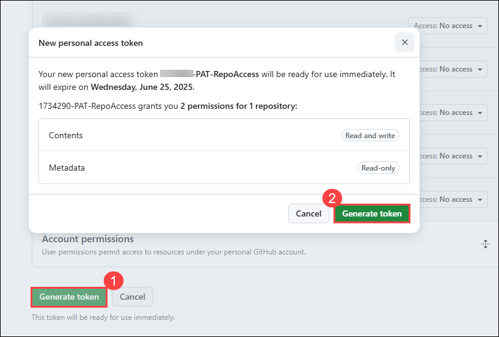
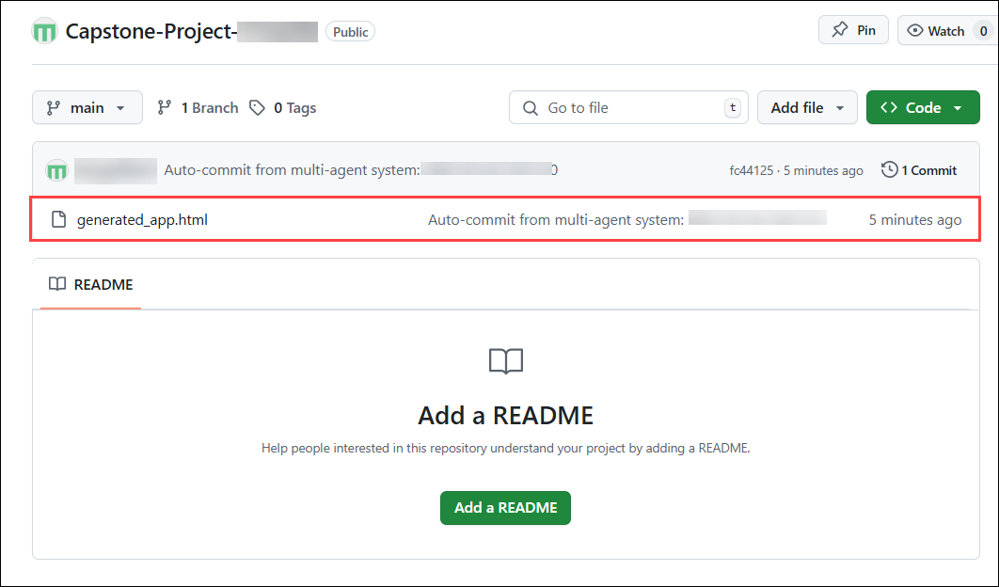

## Guía de Solución
# Sistemas Multi-Agente - Guía de Solución

## Introducción

Los Sistemas Multi-Agente (MAS) consisten en múltiples agentes autónomos, cada uno con objetivos, comportamientos y áreas de responsabilidad distintas. Estos agentes operan de forma independiente, tomando decisiones basadas en su conocimiento local y entorno. Sin embargo, también pueden comunicarse y compartir información entre sí, ya sea cooperando o compitiendo dependiendo de sus objetivos. Los MAS se utilizan típicamente en escenarios donde las tareas están distribuidas entre múltiples entidades y el sistema se beneficia de la descentralización. Las aplicaciones comunes incluyen la gestión del tráfico, equipos robóticos, IA distribuida y sistemas en red donde se requiere coordinación sin depender de un controlador central.

En este desafío, crearás un Multi-Agent System que acepta la solicitud de un usuario y la procesa a través de una colección de agentes, cada uno diseñado con una persona específica y área de especialización. Los agentes analizarán individualmente la solicitud y contribuirán con sus respuestas basándose en sus responsabilidades definidas. La salida final será una colección consolidada de respuestas de todos los agentes, abordando colaborativamente la consulta del usuario de una manera que refleje la perspectiva única de cada persona.

## Tarea 1 - Implementación de Modelo de Azure AI Foundry y Configuración de Entorno

1. Navega a `https://portal.azure.com` e inicia sesión con tus credenciales de Azure.

    - **Correo electrónico/Nombre de usuario**: <inject key="AzureAdUserEmail"></inject>
    - **Contraseña**: <inject key="AzureAdUserPassword"></inject>

1. Busca y selecciona Open AI.

   

1. En la página de contenido de **Azure Open AI (1)**, haz clic en **+ crear (2)**.

   

1. Proporciona los siguientes detalles y haz clic en **Siguiente**:

    - Suscripción: Mantén la suscripción predeterminada **(1)**.

    - Grupo de recursos: Haz clic en **Crear nuevo (2)**, proporciona el nombre como **openaiagents** y haz clic en Aceptar.

    - Región: **East US 2 (3)**

    - Nombre: **OpenAI-<inject key="Deployment ID" enableCopy="false"/>** **(4)**

    - Nivel de precios: **Standard SO (5)**

   

1. Haz clic en **Siguiente** dos veces y luego haz clic en **Revisar + Enviar**.

1. Revisa todos los valores y haz clic en **Crear**.

1. Una vez que la implementación se haya completado, haz clic en **Ir al recurso**.

1. En el panel del recurso de Azure OpenAI, haz clic en **Ir al portal de Azure AI Foundry**, esto te llevará al portal de Azure AI Foundry.

   

1. En el panel izquierdo, selecciona **Implementaciones (1)**. Haz clic en **+ Implementar modelo (2)** y selecciona **Implementar modelo base (3)**.

   

1. Busca **gpt-4o (1)**, **selecciónalo (2)** y haz clic en **Confirmar (3)**.

   

1. Haz clic en **Personalizar** y proporciona los siguientes detalles para implementar un modelo gpt-4o:

    - Nombre de la implementación: **gpt4-o (1)**
    - Tipo de implementación: **Global Standard (2)**
    - Versión del modelo: **2024-11-20 (3)**
    - Establece el **Tokens per Minute Rate Limit** en **200k (4)**.
    - Deja los demás valores como predeterminados y haz clic en **Implementar (5)**.

   

1. Una vez que se complete la implementación de gpt-4o, copia el **Target URI (1)** y la **Key (2)**. **Pega** estos valores en un bloc de notas para usarlos más adelante.

   

1. Abre VS Code en tu máquina virtual de laboratorio. Haz clic en **Archivo (1)** y selecciona **Abrir carpeta (2)**.

   

1. Navega a la ruta `C:\LabFiles\` **(1)**, selecciona **CAPSTONE-PROJECT (2)** y haz clic en **Seleccionar carpeta (3)**.

   

1. Marca la **casilla (1)** y haz clic en **Sí, confío en los autores (2)** para continuar.

   

1. Expande la carpeta **src/ui**, cambia el nombre del archivo de **Sample.env** a **.env**.

   

1. Actualiza el archivo `.env` con los detalles de la implementación de Azure AI Foundry y guarda el archivo:

    ```
    AZURE_OPENAI_CHAT_DEPLOYMENT_NAME=Replace with your deployment name
    AZURE_OPENAI_ENDPOINT=Replace with your endpoint URL
    AZURE_OPENAI_API_KEY=Replace with your API key
    ```
   


## Tarea 2 - Crear un Repositorio de GitHub y Generar un Token PAT

1. Inicia sesión en GitHub en [https://github.com](https://github.com).

1. Crea un nuevo repositorio llamado **Capstone-Project-<inject key="Deployment ID" enableCopy="false"/>** **(1)**. Establece la visibilidad del repositorio en **Público (2)** y luego haz clic en **Crear repositorio (3)**.

   

1. Una vez creado el nuevo repositorio, **copia la URL** de tu repositorio y pégala en un bloc de notas para usarla más adelante.

   

1. Haz clic en tu **foto de perfil (1)** en la esquina superior derecha y selecciona **Configuración (2)** en el menú desplegable.

   

1. En la barra lateral izquierda, haz clic en **<> Configuración de desarrollador**.

   

1. Expande **Personal access tokens** desde el panel izquierdo. Selecciona **Fine-grained tokens (1)** y haz clic en **Generar nuevo token (2)**.

   

1. Ingresa **<inject key="Deployment ID" enableCopy="false"/>-PAT-RepoAccess** **(1)** como nombre para tu token. Establece la fecha de expiración en **30 días (2)**.

   

1. Desplázate hacia abajo y, en **Acceso al repositorio**, haz clic en **Solo seleccionar repositorios (1)**. Busca el repositorio **Capstone-Project-<inject key="Deployment ID" enableCopy="false"/> (2)** y **selecciónalo (3)**.

   

1. En **Permisos**, expande **Permisos de repositorio (1)**. Otorga acceso de **Lectura y Escritura (3)** para **Contents (2)** en los permisos del repositorio.

   

1. Desplázate hasta la parte inferior de la página, haz clic en **Generar token (1)** y en la ventana emergente, revisa los permisos y haz clic en **Generar token (2)**.

   

1. **Copia (1)** el token generado y **pégalo** en un bloc de notas para usarlo más adelante.

   

## Tarea 3 - Definir las Personalidades de los Agentes y Configurar el Chat Multi-Agente

1. Abre el archivo `multi_agent.py`. Aquí es donde implementarás todo el código necesario para este desafío.

1. Reemplaza el código en el archivo **multi_agent.py** con el código del siguiente enlace y guarda el archivo.

    ```
    https://docs-api.cloudlabs.ai/repos/raw.githubusercontent.com/CloudLabsAI-Azure/Capstone-Project/refs/heads/soln-guide/src/ui/multi_agent.py
    ```

    

1. Crea un archivo llamado `push_to_github.sh` dentro del directorio `src/ui`. Pega el código del siguiente enlace y guarda el archivo.

    ```
    https://docs-api.cloudlabs.ai/repos/raw.githubusercontent.com/CloudLabsAI-Azure/Capstone-Project/refs/heads/soln-guide/src/ui/push_to_github.sh
    ```

    

1. Actualiza las siguientes variables de entorno en el archivo `.env` con los valores que copiaste en la Tarea 2 y guarda el archivo.

    ```
    GITHUB_REPO_URL=Reemplaza con tu repositorio de Github
    GITHUB_PAT=Reemplaza con tu token PAT de Github
    GIT_USER_EMAIL=Reemplaza con tu correo electrónico de Github
    GITHUB_USERNAME=Reemplaza con tu nombre de usuario de Github
    ```

    

1. En el archivo `.env`, haz clic en **CRLF (1)** en la barra de estado inferior y cámbialo a **LF (2)** seleccionándolo. Guarda el archivo después de hacer este cambio.

    

1. Verifica que **LF** también esté seleccionado en el archivo `push_to_github.sh`.

    

1. Haz clic en los **tres puntos (1)**. Selecciona **Terminal (2)** y elige **Nuevo Terminal (3)**.

    

1. Ejecuta el siguiente comando:

    ```
    azd auth login
    ```

    

1. Inicia sesión usando las siguientes credenciales:
    - **Correo electrónico/Nombre de usuario**: <inject key="AzureAdUserEmail"></inject>
    - **Contraseña**: <inject key="AzureAdUserPassword"></inject>

1. Ejecuta el siguiente comando para aprovisionar la aplicación web y los recursos necesarios en Azure:

    ```
    azd up
    ```

1. Al ejecutar el comando **azd up**, se te pedirá que proporciones detalles de configuración de forma interactiva. Proporciona los siguientes valores cuando se te soliciten:

   - **Nombre Único del Entorno**: Ingresa **CapstoneEnv-<inject key="Deployment ID" enableCopy="false"/>** **(1)**.
   - **Suscripción de Azure a usar**: Elige la suscripción predeterminada **(2)** que aparece y presiona **Enter**.
   - **Parámetro de Infraestructura Location**: Selecciona **East US 2** **(3)** de las opciones y presiona **Enter**.
   - **Parámetro de Infraestructura ResourceGroupName**: Escribe **CapstoneEnv-<inject key="Deployment ID" enableCopy="false"/>** **(4)** y presiona **Enter**.
   - **Grupo de recursos a usar**: Selecciona **CapstoneEnv-<inject key="Deployment ID" enableCopy="false"/>** **(5)** de las opciones y presiona **Enter**.

   

   - **Nota:** Espera aproximadamente 5 minutos hasta que el comando termine de ejecutarse completamente.

## Tarea 4 - Generación de Código Multi-Agente e Integración con el Repositorio

1. Navega al portal de Azure y selecciona el grupo de recursos recién creado llamado **rg-CapstoneEnv<inject key="Deployment ID" enableCopy="false"/>**.

1. Abre la aplicación contenedor con el prefijo **dev-ui-**.

    

1. Haz clic en la **URL de la Aplicación** que se encuentra en la página de Resumen de la aplicación contenedor.

    

1. Se abrirá la aplicación de chat Streamlit. Intenta proporcionar el **siguiente mensaje (1)** en el chat y haz clic en **enviar**.

    ```
    Create code for simple calculator
    ```
   - **Nota:** Espera hasta que los agentes colaboren y proporcionen una respuesta.

    

1. Una vez que se ejecute y proporcione el código y otros detalles, escribe **approved (1)** y selecciona **enviar (2)** para aprobar el código. Al final del chat, podrás observar que el código se está enviando al repositorio después de la aprobación.

    

    

1. Navega al repositorio **Capstone-Project-<inject key="Deployment ID" enableCopy="false"/>** y verifica que se haya creado el archivo `generated_app.html`, que contiene el código para tu calculadora simple.

    

## Criterios de Éxito

- Has implementado el sistema de chat Multi-Agente que produce:
    - Generación de código fuente completo en HTML y JavaScript para la aplicación solicitada
    - Proceso exhaustivo de revisión y aprobación de código por parte del Usuario
    - Despliegue automatizado de la aplicación en Azure
    - Envío automatizado de código a un repositorio Git tras la aprobación del usuario


## Bono

- Copia el código del historial del chat en formato markdown a los archivos correspondientes en tu sistema de archivos.
- Guarda el contenido HTML como `index.html` y ábrelo en tu navegador web.
- Prueba si la aplicación funciona según lo descrito por la IA.
- Mejora la aplicación pidiendo a la IA que la haga responsiva o que agregue nuevas funcionalidades.
- Experimenta modificando las personalidades para mejorar resultados o funcionalidades.


## Recursos de Aprendizaje

- [Agent Group Chat con Semantic Kernel](https://learn.microsoft.com/en-us/semantic-kernel/frameworks/agent/agent-chat?pivots=programming-language-python)
- [MetaGPT](https://github.com/geekan/MetaGPT)
- [AutoGen Multi-Agent Conversational Framework](https://microsoft.github.io/autogen/docs/Use-Cases/agent_chat/)
- [AutoGen con Semantic Kernel](https://devblogs.microsoft.com/semantic-kernel/autogen-agents-meet-semantic-kernel/)

## Conclusión

Este desafío demostró cómo construir y coordinar un Sistema Multi-Agente usando Azure AI Foundry y Semantic Kernel. Al diseñar personalidades distintas para Analista de Negocios, Ingeniero de Software y Propietario del Producto, y configurar un entorno de chat grupal con una estrategia de terminación, creaste un flujo de trabajo colaborativo de IA capaz de recopilar requerimientos, desarrollar código y realizar revisiones de código. La estructura de la tarea permite un manejo escalable y descentralizado de problemas complejos usando agentes autónomos e interactivos.

# ¡¡Has completado el Laboratorio con éxito!!
